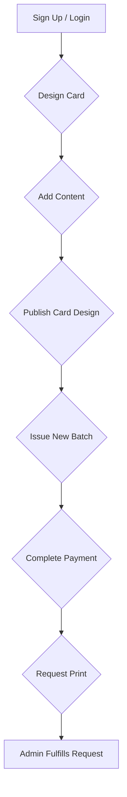

# Cardy - The Modern Card Issuance & Management Platform

Cardy is a comprehensive, modern web application designed for creating, issuing, and managing physical and digital cards. It provides a robust platform for "Card Issuers" to design card templates, manage content, issue cards in batches, and handle physical print requests. The system also includes a full-featured "Admin" panel for user verification, print request fulfillment, and overall system management.

The platform is built on a modern tech stack, including Vue.js 3, PrimeVue, Tailwind CSS for the frontend, and a powerful Supabase backend with a PostgreSQL database and stored procedures for business logic.

## Key Features & Workflows

### 1. User Roles & Authentication
The system supports two primary user roles with distinct capabilities:

-   **Card Issuer**: The primary user of the application. They can:
    -   Sign up and manage their profile.
    -   Undergo a verification process to gain full platform access.
    -   Design and publish card templates.
    -   Manage rich content associated with each card.
    -   Issue cards in batches.
    -   Manage payments for batch issuance.
    -   Request physical printing of card batches.
    -   Manage shipping addresses.

-   **Admin**: System administrators who oversee the platform. They can:
    -   Review and approve/reject Card Issuer verification requests.
    -   Manage all print requests from fulfillment to shipping.
    -   View system-wide statistics and user activity.
    -   Manage user roles and permissions.
    -   Waive batch payment fees when necessary.

### 2. Card Issuer Workflow

The core workflow for a Card Issuer from creation to a physical product is as follows:



**Functional Description:**

1.  **Design Card**: Issuers create a new card design, providing a name, description, and images.
2.  **Add Content**: They add structured content items to the card, which can be viewed by the end-user. This includes an optional AI-powered conversational feature.
3.  **Publish Card**: A card design must be "Published" before any batches can be issued. This finalizes the design.
4.  **Issue New Batch**: The issuer creates a batch of a specific quantity for a published card. At this stage, a payment requirement is generated.
5.  **Complete Payment**: The issuer must pay for the batch ($2.00 per card) via Stripe integration. The system generates a payment intent, and upon successful payment, the cards are officially "generated" in the database.
6.  **Request Print**: Once a batch is paid for and cards are generated, the issuer can submit a print request, selecting a shipping address.
7.  **Withdraw Request**: Issuers can withdraw a print request only if its status is `SUBMITTED`. Once it is `PROCESSING`, it cannot be withdrawn.

### 3. Admin Workflow

Admins manage the operational side of the platform.

**Verification Management:**
-   Admins review pending user verification requests in the "Verifications" panel.
-   They can view submitted documents and either "Approve" or "Reject" the application, providing feedback.

**Print Request Fulfillment:**
-   Admins see all paid and submitted print requests in the "Print Requests" panel.
-   They manage the status through the fulfillment pipeline: `SUBMITTED` -> `PROCESSING` -> `SHIPPED` -> `COMPLETED`.
-   They can add internal admin notes for tracking.

### 4. End-User Experience: The Digital Card

The ultimate goal of Cardy is to deliver a rich, interactive digital experience to the end-user who receives a physical card.


<br/>

1.  **Scan QR Code**: Each physical card features a unique QR code. The end-user scans this code with their mobile device.
2.  **Access Digital Content**: The QR code directs the user's browser to a unique URL for that specific card, activating it upon the first scan.
3.  **Explore**: The user is presented with a mobile-first, interactive view (`PublicCardView.vue`) where they can explore all the rich content, images, and AI-powered conversations that the Card Issuer has associated with the card design.

<div align="center">
  
  <p><i>Sample QR code. In a real scenario, this would link to the unique issued card URL.</i></p>
</div>

### 5. Database & Security Model

-   The backend is powered by **Supabase** and **PostgreSQL**.
-   Business logic is encapsulated in **database stored procedures** (`schemaStoreProc.sql`). This ensures data integrity and a secure-by-default architecture.
-   **Row-Level Security (RLS)** is enabled on all tables (`policy.sql`). Policies are generally restrictive, forcing all data modifications to go through the defined stored procedures, which run with elevated privileges (`SECURITY DEFINER`). This prevents unauthorized direct table access.

### 6. Admin Feedback & Audit System

The platform includes a comprehensive system for tracking administrative actions and managing feedback:

#### Admin Audit Log
- **Purpose**: Maintains a detailed record of all administrative actions for accountability and tracking.
- **Key Features**:
  - Records who performed the action (admin) and who was affected (target user)
  - Stores action types (e.g., 'ROLE_CHANGE', 'MANUAL_VERIFICATION')
  - Preserves before/after states of changes
  - Captures admin-provided reasons for actions
  - Stores action-specific details in flexible JSONB format

#### Admin Feedback History
- **Purpose**: Provides versioned history of all administrative feedback and notes.
- **Features**:
  - Supports multiple feedback types:
    - Verification feedback
    - Print request notes
    - Role change reasons
    - General admin notes
  - Maintains version history of all feedback
  - Links versions through parent-child relationships
  - Ensures only one current version per feedback thread
  - Stores contextual information about triggering actions

#### Integration Points
The system automatically records feedback and audit trails for:
- User verification reviews
- Print request status updates
- Role changes
- Payment waivers
- Manual verification actions

#### Access Control
- Only administrators can create and view audit logs
- Feedback visibility is controlled based on context:
  - Admins can view all feedback
  - Users can view their own verification feedback
  - All access is managed through secure stored procedures

## Project Setup

Follow these steps to set up and run the Cardy project locally.

### Prerequisites

-   **Node.js**: v18 or later.
-   **pnpm**: Recommended package manager. If you don't have it, run `npm install -g pnpm`.
-   **Supabase Account**: You will need a Supabase project.
-   **Stripe Account**: For payment processing.

### 1. Clone the Repository

```bash
git clone <repository-url>
cd Cardy
```

### 2. Install Dependencies

```bash
pnpm install
```

### 3. Supabase Setup

1.  **Create a Supabase Project**: Go to [supabase.com](https://supabase.com) and create a new project.
2.  **Database Setup**:
    -   Navigate to the **SQL Editor** in your Supabase project dashboard.
    -   Copy the entire contents of `sql/schema.sql` and run it. This creates the tables, enums, and indexes.
    -   Copy the entire contents of `sql/schemaStoreProc.sql` and run it. This creates all the necessary functions and procedures.
    -   Copy the entire contents of `sql/policy.sql` and run it. This applies the Row-Level Security policies.
    -   (Optional) Run `sql/schemaDataInit.sql` to seed your database with initial data.
3.  **Get Supabase Credentials**:
    -   In your Supabase project, go to **Project Settings** > **API**.
    -   You will need the **Project URL** and the `anon` **public** key.

### 4. Environment Variables

Create a `.env` file in the root of the project and add your Supabase credentials:

```
VITE_SUPABASE_URL="YOUR_SUPABASE_PROJECT_URL"
VITE_SUPABASE_ANON_KEY="YOUR_SUPABASE_ANON_KEY"
```

### 5. Running the Project

Once the setup is complete, you can run the development server:

```bash
pnpm run dev
```

The application will be available at `http://localhost:5173` (or another port if 5173 is in use).

### 6. Set an Admin User

By default, new users are assigned the `cardIssuer` role. To create an admin user, you need to manually update the user's role in the Supabase dashboard:

1.  Sign up a new user in the application.
2.  Go to **Authentication** in your Supabase project dashboard.
3.  Find the new user and click to edit their details.
4.  Under **User Metadata**, add or update the `role` property:
    ```json
    {
      "role": "admin"
    }
    ```
5.  Save the changes. The user will now have admin privileges upon their next login.
